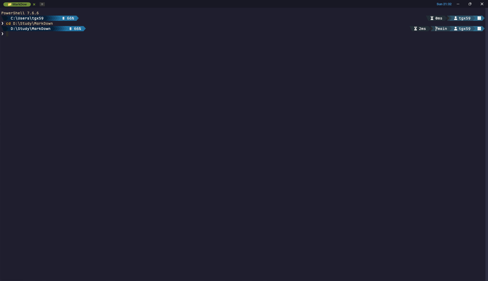
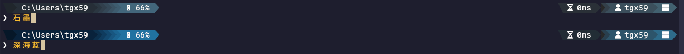

# My WezTerm Config

> 一套开箱即用的 Windows 终端配置：**WezTerm + PowerShell 7 + Oh My Posh**，
> 模块化 Lua 配置、两套可秒切配色、一键部署脚本。

[](#)
[](#)
[](#)
[](#)
[](LICENSE)

---

## 目录

- [这是什么](#这是什么)
- [界面预览](#界面预览)
- [组成与依赖](#组成与依赖)
- [快速开始](#快速开始)
  - [1. 安装依赖](#1-安装依赖)
  - [2. 获取配置](#2-获取配置)
  - [3. 一键部署](#3-一键部署)
  - [4. 验证](#4-验证)
- [仓库结构](#仓库结构)
- [配置详解](#配置详解)
  - [WezTerm](#wezterm)
  - [Oh My Posh 主题](#oh-my-posh-主题)
  - [PowerShell profile](#powershell-profile)
- [自定义指南](#自定义指南)
- [常见问题](#常见问题)
- [与上游的关系](#与上游的关系)
- [更新日志](#更新日志)
- [致谢与许可](#致谢与许可)

---

## 这是什么

面向 Windows 开发机的终端环境配置，由三层组件构成，各自职责清晰、可以单独替换：

| 层 | 组件 | 负责什么 |
|---|---|---|
| 终端模拟器 | **WezTerm**（nightly） | 窗口 / 标签 / 窗格 / 键位 / 字体渲染 / GPU 加速 |
| Shell | **PowerShell 7** | 命令解释、模块、启动逻辑（profile） |
| 提示符 | **Oh My Posh** | 渲染提示符：路径、Git 状态、语言版本、内存、执行时间 |

这套配置的特点：

- **模块化 Lua 配置**：WezTerm 侧拆成 `config/`（声明式设置）+ `events/`（自绘标签栏、状态栏），改哪块找哪个文件即可，长期可维护。
- **两套可秒切的 Oh My Posh 配色**：`深海蓝`（蓝色渐变）与 `石墨`（低饱和灰蓝），均为链式 powerline 布局，一行命令切换。
- **响应式提示符**：窗口变窄时次要信息自动隐藏，避免第一行挤爆换行。
- **一键部署脚本**：`install.ps1` 自动备份旧配置 + 复制新配置 + 提示剩余手动步骤。

---

## 界面预览

提示符分两行：第一行是状态信息（路径 / 语言版本 / 内存 / Git / 时间），第二行是输入行。

<p align="center">
  
</p>

> 色块之间的 `▶` 是 powerline 过渡三角。没有内容的段（例如当前目录不是 Node 项目时的 `node` 段）
> 只会留下一个颜色过渡，不会断开整条颜色链。

两套配色的色值与对比度对照：

<p align="center">
  
</p>

| 主题 | 色系 | 左链末端色 | 最低文字对比度 |
|---|---|---|---|
| `myconfig_深海蓝` | 蓝，全程白字 | `#2172A1` | 5.27:1 |
| `myconfig_石墨` | 低饱和灰蓝，全程白字 | `#42667B` | 6.14:1 |

---

## 组成与依赖

开发与测试所用版本，其它版本一般也能用：

| 组件 | 版本 | 安装方式 | 备注 |
|---|---|---|---|
| WezTerm | `20260929-043349-cab25161`（nightly） | `scoop install wezterm-nightly` | 稳定版长期停留在 `20240203`，本配置用到了 nightly 字段 |
| Oh My Posh | `31.4.1` | `scoop install oh-my-posh` | |
| PowerShell | `7.6.6` | 官方安装包 / winget | **必须是 7.x**，Windows PowerShell 5.1 不会读取本仓库的 profile |
| Maple Mono NF CN | `7.9` | `scoop install Maple-Mono-NF-CN` | 提供等宽 + Nerd Font 图标 + 中文 + 连字 |
| Git | 任意 | `scoop install git` | git 段与版本管理需要 |
| Scoop | `v0.6.0` | 官方脚本 | 仅为示例，可换成 winget / choco |

字体是**硬性依赖**：主题大量使用 Nerd Font 图标（`\ue0b0`、`\ue738` 等），字体缺失会显示成方框 `□`。
用其它 Nerd Font 也可以，改 `wezterm/config/fonts.lua` 里的字体名即可。

---

## 快速开始

### 1. 安装依赖

```powershell
# Scoop
scoop bucket add versions
scoop bucket add nerd-fonts
scoop install wezterm-nightly oh-my-posh Maple-Mono-NF-CN git

# 或者用 winget
winget install wez.wezterm JanDeDobbeleer.OhMyPosh Microsoft.PowerShell
# 字体仍建议用 scoop 装，或从 https://www.nerdfonts.com/ 手动下载安装
```

### 2. 获取配置

```powershell
git clone https://github.com/WAerWAK/My-WezTerm-Config.git D:\Projects\WezTermConfig
cd D:\Projects\WezTermConfig
```

### 3. 一键部署

```powershell
# 交互式，每一步都会问你
.\install.ps1

# 或者直接部署全部，不问
.\install.ps1 -Force

# 只想更新提示符主题，不动 WezTerm 配置和 profile
.\install.ps1 -Force -SkipWezTerm -SkipProfile
```

脚本的行为：

1. 检查 `wezterm` / `oh-my-posh` / `pwsh` 是否就绪；
2. 把已存在的目标配置**改名**为 `<原名>.bak-<时间戳>`（只改名，不删除任何文件）；
3. 从仓库复制配置到位；
4. 打印还需要手动完成的步骤。

| 配置 | 部署到 |
|---|---|
| WezTerm | `~/.config/wezterm`（Windows 为 `%USERPROFILE%\.config\wezterm`） |
| Oh My Posh 主题 | `~/.config/omp` |
| PS7 profile | `~/Documents/PowerShell/Microsoft.PowerShell_profile.ps1`（macOS/Linux 为 `~/.config/powershell/`） |

**回滚**：把 `<目标>.bak-<时间戳>` 改回原名字即可。

### 4. 验证

重新打开 WezTerm（或新开一个标签页），然后在 PowerShell 里：

```powershell
Get-OmpThemePath      # 应指向 ~/.config/omp/<主题名>.omp.json
Get-OmpTheme          # 当前主题名，例如 myconfig_深海蓝
wezterm show-keys     # 能看到配置里的键位，说明 WezTerm 配置已加载
```

---

## 仓库结构

```
My-WezTerm-Config/
├── README.md                        本文件
├── install.ps1                      一键部署脚本（备份 + 复制 + 提示）
├── LICENSE                          MIT 许可证
├── .gitattributes / .gitignore
├── docs/                            文档配图
│
├── wezterm/                         → 部署到 ~/.config/wezterm
│   ├── wezterm.lua                  入口：装配各模块 + 注册事件钩子
│   ├── config/
│   │   ├── init.lua                 Config 构造器（提供 :append 合并）
│   │   ├── appearance.lua           外观：GPU 前端 / 帧率 / 渐变背景 / 标签栏 / 光标 / 窗口按钮
│   │   ├── bindings.lua             键位表 + key tables + 鼠标绑定
│   │   ├── domains.lua              SSH / WSL / Unix 域
│   │   ├── fonts.lua                字体与字号
│   │   ├── general.lua              行为项 + hyperlink_rules
│   │   └── launch.lua               默认 shell 与启动菜单
│   ├── events/
│   │   ├── right-status.lua         右侧状态栏（日期）
│   │   ├── tab-title.lua            标签标题（自绘胶囊样式）
│   │   └── new-tab-button.lua       标签栏「+」按钮（左键新建 / 右键菜单）
│   ├── colors/custom.lua            备用配色（微调版 Catppuccin Mocha，默认未启用）
│   ├── utils/
│   │   ├── math.lua                 clamp / round
│   │   └── platform.lua             is_win / is_mac / is_linux 判定
│   ├── backdrops/space.jpg          背景图素材（默认未启用）
│   ├── .editorconfig / .stylua.toml / selene.toml / .luarc.json   代码风格与 lint
│   └── LICENSE                      上游 MIT 许可证
│
├── omp/                             → 部署到 ~/.config/omp
│   ├── myconfig_深海蓝.omp.json      主题：蓝色渐变
│   ├── myconfig_石墨.omp.json        主题：低饱和灰蓝渐变
│   └── current-theme.txt            当前启用哪套（一行纯文本，内容就是主题名）
│
└── powershell/                      → 部署到 PS7 的 profile 位置
    └── Microsoft.PowerShell_profile.ps1
```

---

## 配置详解

### WezTerm

#### 加载顺序

WezTerm 按下面的顺序查找配置，**先命中者生效**：

| 优先级 | 位置 | 说明 |
|---|---|---|
| 1 | 命令行 `--config-file <路径>` | 临时测试用 |
| 2 | 环境变量 `WEZTERM_CONFIG_FILE` | 一般不使用 |
| 3 | `~/.config/wezterm/wezterm.lua` | ✅ **本配置走这里** |
| 4 | `~/.wezterm.lua` | ⚠️ **只要这个文件存在，第 3 项就永远不会被加载** |

> 从别的配置迁移过来时，务必确认 `~/.wezterm.lua` 不存在，否则你会以为配置没生效。

#### 模块职责

`wezterm.lua` 只做两件事：注册三个事件钩子、把 `config/` 下的模块 `:append` 进来。

| 模块 | 关键内容 |
|---|---|
| `appearance.lua` | `front_end = "WebGpu"`、`animation_fps = 60`、窗口背景渐变、`use_fancy_tab_bar = true`、`window_decorations = "INTEGRATED_BUTTONS\|RESIZE"`、`initial_cols = 120` / `initial_rows = 24`、`window_close_confirmation = "AlwaysPrompt"` |
| `bindings.lua` | 全量键位（已关闭默认键位），含 `Ctrl+Shift+Space` leader 键表 |
| `fonts.lua` | `Maple Mono NF CN`，字号 11（macOS 12） |
| `launch.lua` | 默认 shell `pwsh`，`F3` 启动菜单（PowerShell 5.1 / 7 / Cmd / GitBash / WSL / 管理员 WezTerm） |
| `domains.lua` | SSH / WSL / Unix 域定义 |
| `general.lua` | 行为开关 + `hyperlink_rules` |

#### 常用快捷键

> **⚠️ 修饰键不是 Win 键。** `bindings.lua` 开头把修饰键做了平台映射：
>
> ```lua
> if platform.is_mac then
>   mod.SUPER     = "SUPER"        -- macOS：Command 键
>   mod.SUPER_REV = "SUPER|CTRL"
> elseif platform.is_win or platform.is_linux then
>   mod.SUPER     = "ALT"          -- Windows / Linux：Alt 键（避免冲突系统 Win 快捷键）
>   mod.SUPER_REV = "ALT|CTRL"
> end
> ```
>
> 所以下面的 `Alt+…` 在 macOS 上对应 `Command+…`，`Alt+Ctrl+…` 对应 `Command+Ctrl+…`。

| 按键（Windows / Linux） | macOS | 作用 |
|---|---|---|
| `F1` | 同 | 进入复制模式（vi 风格选择） |
| `F2` | 同 | 命令面板 |
| `F3` | 同 | 启动菜单（模糊搜索，列出 `launch_menu` 各项） |
| `F4` | 同 | 标签导航器 |
| `F11` / `F12` | 同 | 全屏 / 调试浮层 |
| `Ctrl+C` / `Ctrl+V` | 同 | 复制 / 粘贴 |
| `Ctrl+Shift+R` | 同 | 重命名当前标签 |
| `Alt+F` | `Cmd+F` | 搜索 |
| `Alt+T` | `Cmd+T` | 新建标签 |
| `Alt+Ctrl+W` | `Cmd+Ctrl+W` | 关闭当前标签 |
| `Alt+[` / `Alt+]` | `Cmd+[` / `Cmd+]` | 上一个 / 下一个标签 |
| `Alt+Ctrl+[` / `Alt+Ctrl+]` | `Cmd+Ctrl+[` / `]` | 向前 / 向后移动标签 |
| `Alt+N` | `Cmd+N` | 新建窗口 |
| `Alt+A` | — | 以管理员身份启动 WezTerm（仅 Windows，会弹 UAC） |
| `Alt+W` | `Cmd+W` | 关闭当前窗格 |
| `Alt+Ctrl+/` | `Cmd+Ctrl+/` | 垂直分屏 |
| `Alt+Ctrl+\` | `Cmd+Ctrl+\` | 水平分屏 |
| `Alt+Ctrl+-` | `Cmd+Ctrl+-` | 关闭当前窗格（带确认） |
| `Alt+Ctrl+Z` | `Cmd+Ctrl+Z` | 窗格最大化切换 |
| `Alt+Ctrl+H/J/K/L` | `Cmd+Ctrl+H/J/K/L` | 按方向切换窗格 |
| `Alt+Ctrl+方向键` | `Cmd+Ctrl+方向键` | 调整窗格大小 |
| `Alt+方向键` | `Cmd+方向键` | 增大 / 减小字号 |
| `Alt+R` | `Cmd+R` | 重置字号 |
| `Ctrl+Shift+Space` | 同 | leader 键，之后按 `F` 调字号、按 `P` 调窗格大小（`Esc` / `Q` 退出键表） |

完整键位见 `wezterm/config/bindings.lua`，或运行 `wezterm show-keys` 查看当前生效的全部绑定。

#### 相对上游的改动

`wezterm/` 目录派生自 [QianSong1/wezterm-config](https://github.com/QianSong1/wezterm-config)，
为了在 Windows 开发机上可用，做了这些修改（源码里都有 `本机适配` 注释）：

| 文件 | 改动 |
|---|---|
| `fonts.lua` | 字体由 `JetBrainsMono NF` 改为 `Maple Mono NF CN`（前者未安装会回退默认字体导致图标缺失），字号 9 → 11 |
| `launch.lua` | 默认 shell 由 `powershell`（5.1）改为 `pwsh`（7），否则 Oh My Posh 提示符不加载；GitBash 路径改为本机 scoop 路径；SSH 主机条目替换为 WSL 域；新增「管理员 WezTerm」入口 |
| `bindings.lua` | 新增 `Alt+A` 管理员启动；`F3` 改为与标签栏「+」右键菜单一致的模糊搜索面板 |
| `domains.lua` / `events/*` | 域、标签栏与状态栏的细节调整 |

> ⚠️ **换机器需要改**：`config/launch.lua` 里 GitBash 的绝对路径
> （`D:\Apps\Scoop\apps\git\current\bin\bash.exe`）是按原机器写的。

### Oh My Posh 主题

#### 主题是怎么被选中的

主题文件全部放在 `~/.config/omp`（**不是** scoop 内置主题目录，避免 `scoop update` 覆盖）。
选哪套由 profile 里的逻辑按优先级决定：

| 优先级 | 来源 | 作用范围 | 怎么改 |
|---|---|---|---|
| 1 | 环境变量 `$env:OMP_THEME` | 仅当前会话 | `Set-OmpTheme 石墨 -SessionOnly` |
| 2 | `~/.config/omp/current-theme.txt` | 持久 | `Set-OmpTheme 石墨` |
| 3 | 主题目录里排序最靠前的一套 | 兜底 | 无需干预 |

解析出的路径是 `~/.config/omp/<主题名>.omp.json`；找不到时才去 `$env:POSH_THEMES_PATH` 找同名文件。

#### 主题结构

两套主题**共用同一骨架，只有 12 个 `background` 值不同**。

| 块 | 对齐 | 内容 |
|---|---|---|
| 1 | left | `root` → `path` → `java` → `node` → `python` → `rust` → `kotlin` → `sysinfo`，颜色由深到浅 |
| 2 | right | `executiontime` → `git` → `session` → `os` |
| 3 | left（换行） | `status`：`❯`，上一条命令失败时变红 |

| 段 | 样式 | 说明 |
|---|---|---|
| `root` | `diamond` + `leading_diamond` `\ue0be` | 提权会话显示 ⚡；普通会话输出占位符 U+2800，只保留一个颜色过渡 |
| `path` | `powerline` | `options.style = full` 始终显示完整路径；`mapped_locations_enabled: false` 让家目录也展开成完整路径 |
| `java` `node` `python` `rust` `kotlin` | **`accordion`** | 有对应项目文件时显示「图标 + 版本」；没有时只画颜色过渡，且**完全不查询版本**（零开销） |
| `sysinfo` | `powerline` | 物理内存占用百分比 |
| `executiontime` | `diamond` | 首尾三角，`always_enabled: true` |
| `git` | `accordion` | 非 Git 仓库时只留过渡色 |
| `session` / `os` | `powerline` | 用户名、系统图标 |

#### 响应式：窄窗口自动让位

`min_width` 表示「终端宽度小于该值就隐藏这个段」。本配置用它给第一行减负：

| 段 | `min_width` | 含义 |
|---|---|---|
| `executiontime` | 100 | 窗口窄于 100 列时隐藏 |
| `session` | 140 | 窗口窄于 140 列时隐藏 |
| `os` | 130 | 窗口窄于 130 列时隐藏 |

> 注意：`accordion` 样式的段**不受 `min_width` 影响**（该样式的定义就是「禁用时仍绘制色块」），
> 所以语言段和 `git` 段没有宽度门槛。能靠 `min_width` 瘦身的只有 `powerline` / `diamond` 样式的段。

#### 配色约定

链条颜色从左到右由深到浅，文字统一白色，因此最右端的亮度必须压住
（与白字的对比度 ≥ 4.5:1，即 WCAG AA），否则浅色块上的白字会发糊。
改色时可以直接参考 `docs/配色对比图.png` 里的对比度数值。

### PowerShell profile

`Microsoft.PowerShell_profile.ps1` 按顺序做四件事：

| 顺序 | 内容 | 说明 |
|---|---|---|
| 1 | PowerToys CommandNotFound | 输入未安装的命令时提示用 winget 安装 |
| 2 | GitHub PAT 注入 | 从 `~/.dsh/secrets/github_token.dpapi`（DPAPI 加密）解密写入 `$env:GITHUB_TOKEN`；文件不存在时静默跳过 |
| 3 | Oh My Posh 初始化 | 定义 `Get-OmpTheme` / `Get-OmpThemePath` / `Set-OmpTheme`，再按优先级解析主题并加载；一套都找不到时退回内置默认主题 |
| 4 | PSReadLine 增强 | 历史 + 插件预测、ListView 视图、Windows 编辑模式、Tab 菜单补全、上下键历史搜索 |

> 第 2 段依赖一个本机生成、**无法跨机器解密**的令牌文件。不需要 GitHub API 的话，
> 删掉这一整段即可，其余功能不受影响。

---

## 自定义指南

| 想改什么 | 改哪个文件 | 生效方式 |
|---|---|---|
| 终端外观（透明、渐变、光标、窗口按钮） | `wezterm/config/appearance.lua` | 保存即热重载 |
| 键位 | `wezterm/config/bindings.lua` | 保存即热重载 |
| 字体 / 字号 | `wezterm/config/fonts.lua` | 保存即热重载 |
| 默认 shell、启动菜单 | `wezterm/config/launch.lua` | 保存即热重载 |
| 标签栏、状态栏 | `wezterm/events/*.lua` | 保存即热重载 |
| 提示符颜色 | `omp/myconfig_*.omp.json` 里各段的 `background` | 存盘后新开标签页；当前窗口用 `Set-OmpTheme <名字>` 立即生效 |
| 提示符段（增删改） | 同上，`blocks[].segments[]` | 同上 |
| 主题选择 / 别名 / 环境变量 | `powershell/Microsoft.PowerShell_profile.ps1` | `. $PROFILE` 或新开标签页 |

### 常用命令

```powershell
# 主题
Get-OmpTheme                        # 当前主题名
Get-OmpThemePath                    # 当前实际加载的主题文件全路径
Set-OmpTheme 石墨                    # 切换并记忆（下次开终端仍生效）
Set-OmpTheme 深海蓝 -SessionOnly     # 只影响当前会话

# 新增一套自己的配色
Copy-Item ~\.config\omp\myconfig_深海蓝.omp.json ~\.config\omp\myconfig_我的.omp.json
# 改完里面的 background 后用名字切换即可，名字可以只写一部分
Set-OmpTheme 我的

# 排查
oh-my-posh debug                    # 看各段渲染耗时
wezterm show-keys                   # 看当前生效的键位
wezterm ls-fonts --list-system      # 看系统里装了哪些字体
```

---

## 常见问题

**Q：图标显示成方框 `□`**
字体没装或字体名写错。用 `wezterm ls-fonts --list-system | Select-String "Maple"` 确认字体已安装，
再核对 `config/fonts.lua` 里的字体名是否与系统里的一致。

**Q：提示符没变成 Oh My Posh 样式**
依次检查：默认 shell 是不是 `pwsh`（5.1 不读本仓库的 profile）→ profile 是否被部署到正确位置 →
`Get-Command oh-my-posh` 能否找到命令 → `Get-OmpThemePath` 是否指向 `~/.config/omp/` 下的主题文件。

**Q：改了 WezTerm 配置完全没反应**
检查 `~/.wezterm.lua` 是否存在 —— 它优先级高于 `~/.config/wezterm/wezterm.lua`，
存在时后者永远不会被加载。

**Q：提示符显示有点慢**
用 `oh-my-posh debug` 看各段耗时。常见的两处开销：`git` 段（仓库越大越慢，可关掉 `fetch_status`）、
语言段（在对应项目目录里会查询版本，Python 若走 pyenv 的 `python.bat` shim 可能单段上百毫秒）。

**Q：同一套配色在 Windows Terminal 里看起来不一样**
在 Windows Terminal 的 **设置 → 配置文件 → 外观** 里关闭
「Adjust indistinguishable colors / 调整难以区分的颜色」，它会自动改动对比度不足的前景色和背景色，
把 powerline 分隔符和相邻色块调得不一致。

**Q：想临时用不带任何配置的界面排查问题**
```powershell
wezterm --config-file NUL start      # Windows
wezterm --config-file /dev/null start  # macOS / Linux
```

---

## 与上游的关系

`wezterm/` 目录派生自 [QianSong1/wezterm-config](https://github.com/QianSong1/wezterm-config)
（其本身基于 KevinSilvester/wezterm-config 改造），沿用其 MIT 许可证，许可证副本见
[`wezterm/LICENSE`](wezterm/LICENSE)。

想跟进上游更新：

```powershell
cd D:\Projects\WezTermConfig
git remote add upstream https://github.com/QianSong1/wezterm-config.git
git fetch upstream
git diff upstream/main -- wezterm/      # 先看差异，再决定要不要合并
git merge upstream/main                 # 冲突通常出现在「相对上游的改动」那一节列出的文件里
```

`omp/`、`powershell/`、`install.ps1` 与本文件为本仓库原创，同样以 MIT 许可发布。

---

## 更新日志

| 日期 | 内容 |
|---|---|
| 2026-10-04 | 仓库建立：整理 WezTerm 配置、两套 Oh My Posh 主题与 profile，加入 `install.ps1` 和本文档 |
| 2026-10-04 | 提示符加入窄窗口响应式门槛（executiontime 100 / session 140 / os 130） |
| 2026-10-04 | 修正提示符普通会话占位符的字符宽度问题，解决输入时光标下移一行 |

---

## 致谢与许可

- WezTerm 配置派生自 [QianSong1/wezterm-config](https://github.com/QianSong1/wezterm-config)（MIT）。
- 提示符由 [Oh My Posh](https://ohmyposh.dev/) 渲染。
- 字体 [Maple Mono NF CN](https://github.com/subframe7536/maple-font)。
- 本仓库以 **MIT** 许可证发布，见 [`LICENSE`](LICENSE)。
